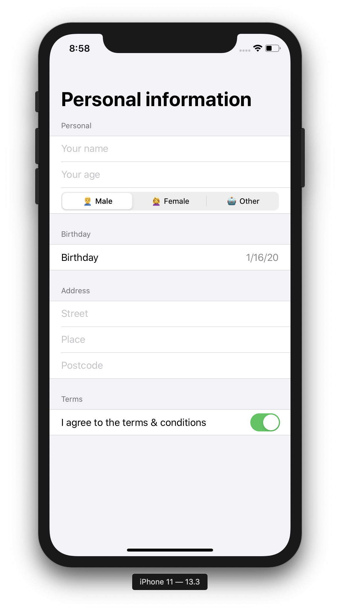

# SwiftUI Forms
Example of forms in SwiftUI. Explanation about the form fields can be found in my blogpost "[Create a form with SwiftUI](https://zonneveld.dev/swiftui-form/)".

# Form fields & containers
Form fields:
 - TextField
 - Picker
 - DatePicker
 - Toggle

 Containers:
  - Form
  - Section

# Screenshot
